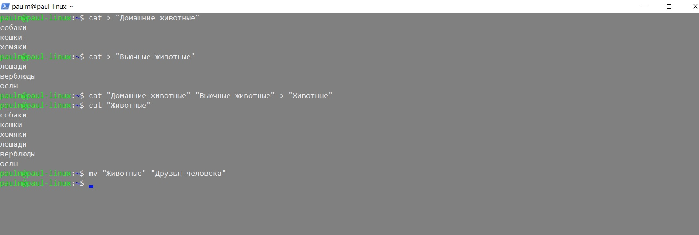
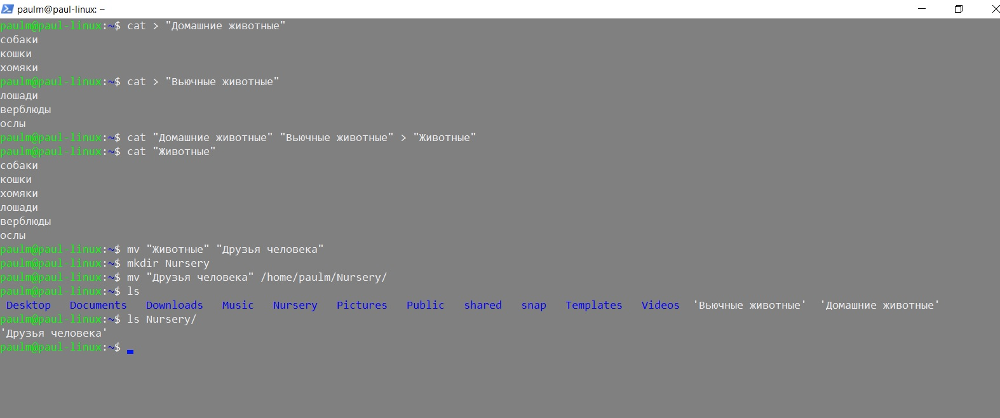
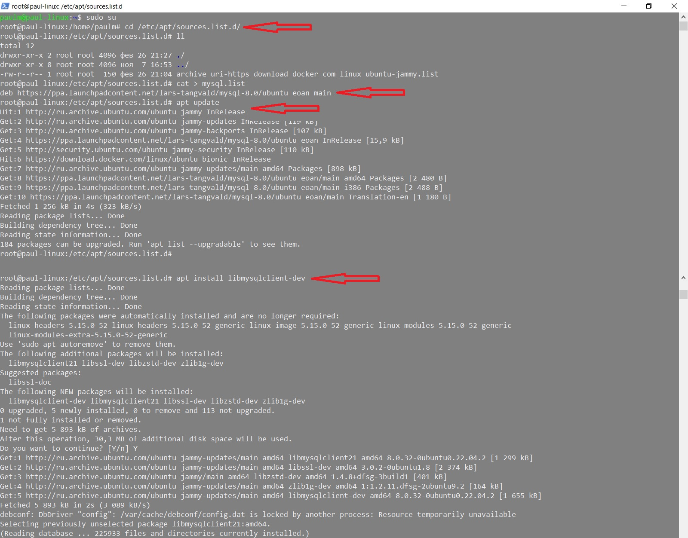
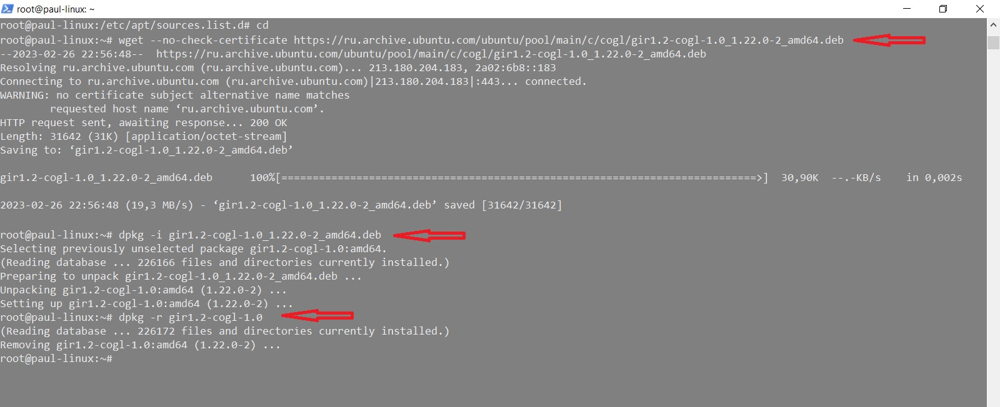

# Итоговая аттестация по пройденным курсам факультета **Разработчик-Программист**

### Студент *Марталлер Павел*

Условия задачи - в файле *Final_certification-task_conditions.pdf* 

Пул-реквесты на изменение - от пользователя [PaulMart85](https://github.com/PaulMart85 "Ссылка на аккаунт разработчика")

# Решение

1. 
2. 
3. 
4. 