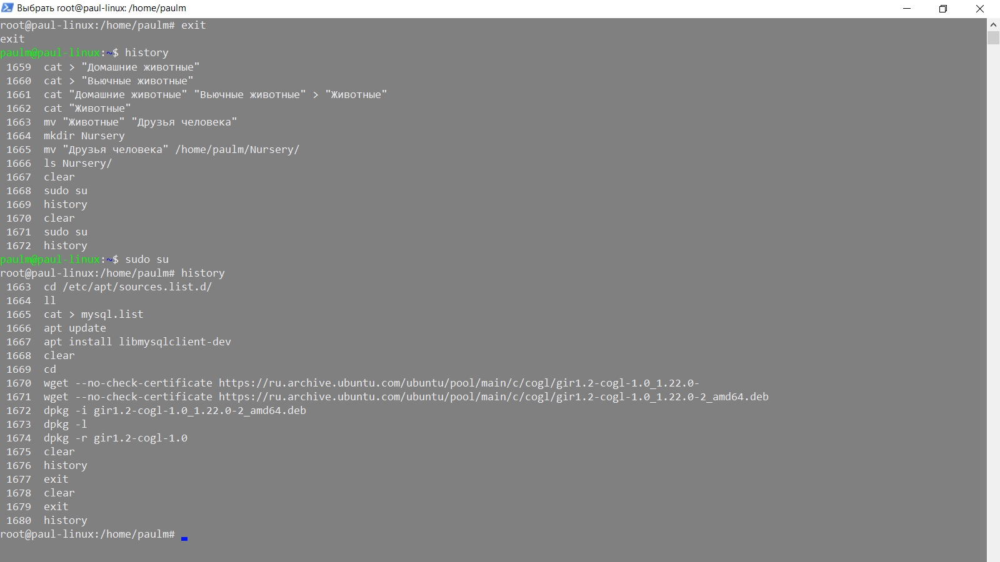

# Итоговая аттестация по пройденным курсам факультета **Разработчик-Программист**

### Студент *Марталлер Павел*

Условия задачи - в файле *Final_certification-task_conditions.pdf* 

Пул-реквесты на изменение - от пользователя [PaulMart85](https://github.com/PaulMart85 "Ссылка на аккаунт разработчика")

# Решение

1. 
2. 
3. 
4. 
5. 
6.  [Диаграмма классов](Diagrams/ClassDiagram.drawio "Task6")
7. -12. Работа с БД [MansFriendsDB](MansFriendsDB.sql "Task7-12")
13. -14. Программа реестра ДОМАШНИХ ЖИВОТНЫХ (см. проект Nursery) создана в IntelliJ IDEA 2022.2.1 (Community Edition) с использованием Designer форм. Реализована часть функционала, при этом протянута цепочка через всю схему паттерна MVC: контроллер максимально абстрагирует представление и модель посредством назначенных интерфейсов, через которые с ними и взаимодействует. При этом использован Observer, который подписывает контроллер на надлюдение за событиями представления. Представление же сообщает наблюдателям о событиях, проиходящих на форме (клиенте), а также передает данные пользователя контроллеру. Оповещенный контроллер подтягивает методы модели, передавая данные от представления, а сформированные от модели данные (сущности) направляет в базу данных. С БД контроллер также взаимодействует не напрямую, а через репозиторий (реализован паттерн Repository), который позволяет максимально абстрагироваться от деталей работы с БД. В свою очередь репозиторий реализует взаимодействие с БД через ORM MyBatis (TODO).